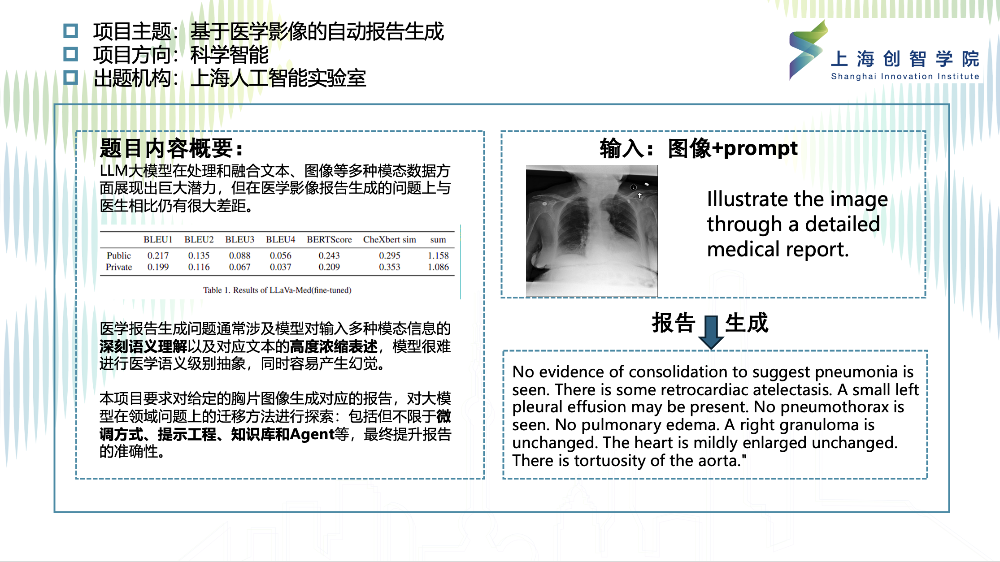
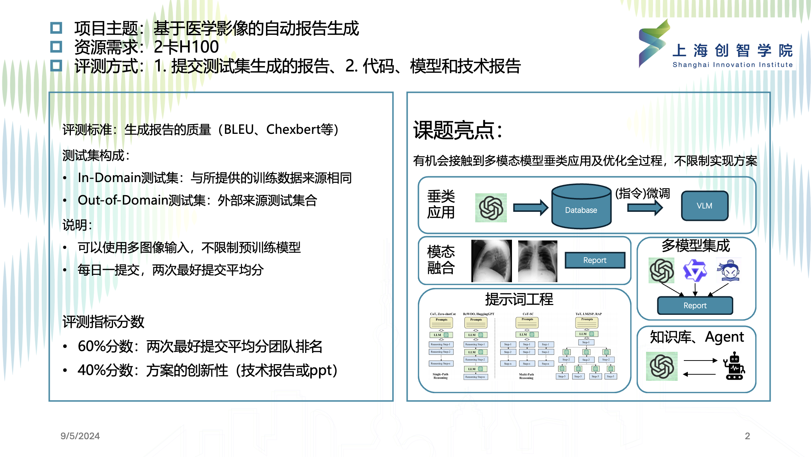
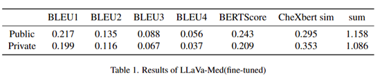

# LLaVa-Med SFT for X-ray Report Generation. (Autumn Project for Sii.)


## Overview
We provide an example of SFT (Supervised Fine-Tuning) based on [LLaVa-med](https://github.com/microsoft/LLaVA-Med) for chest X-ray report generation. For this project, you are required to explore various optimization methods, including but not limited to prompt engineering, fine-tuning techniques, and Agent collaboration. The example only utilizes AP and PA view images of chest X-rays. In practice, when generating reports, you can also choose other views such as lateral view images to enhance the accuracy of the generated reports. Note the `data/public/test.json` and `data/private/private_test.json` are used to generate reports for evaluation.
## Contents
- [Install](#Install)
- [Model](#Model)
- [Dataset](#Dataset)
- [Training](#Training)
- [Inference](#Inference)
- [Metrics](#Metrics)

## Install
1. Config proxy
```bash
pip3 config set global.index-url http://nexus.sii.shaipower.online/repository/pypi/simple/
pip3 config set global.trusted-host nexus.sii.shaipower.online
export HF_ENDPOINT="https://hf-mirror.com"
sed -i '1i deb http://nexus.sii.shaipower.online/repository/ubuntu/ jammy main' /etc/apt/sources.list
conda config --remove channels defaults
conda config --add channels http://nexus.sii.shaipower.online/repository/anaconda/main
# 以下channel按需添加
conda config --add channels http://nexus.sii.shaipower.online/repository/anaconda/r
conda config --add channels http://nexus.sii.shaipower.online/repository/anaconda/msys2
conda config --set custom_channels.pytorch http://nexus.sii.shaipower.online/repository/conda-cloud
conda config --set custom_channels.pytorch3d http://nexus.sii.shaipower.online/repository/conda-cloud
conda config --set custom_channels.nvidia http://nexus.sii.shaipower.online/repository/conda-nvidia
apt update
apt install tmux -y

```
<!-- 1. Clone this repository and navigate to LLaVa-med-report folder
```bash
git clone https://github.com/justfine042/LLaVa-med-report.git
cd LLaVa-med-report
``` -->

2. Install Package: Create conda environment

```Shell
conda create -n llava-med-report python=3.10 -y
conda activate llava-med-report
pip install --upgrade pip  # enable PEP 660 support
pip install -e .
pip install einops ninja open-clip-torch
pip install flash-attn --no-build-isolation
pip install nltk
pip install shortuuid
pip install statsmodels
pip install bert_score
pip install fast_bleu
pip install scikit-learn
```
## Model
To ensure the smooth adaptation in terms of the multimodal chat capability and biomedical knowledge understanding, we initialize model weights (delta version) from LLaVa-Med v1.0. The delta weights of LLaVa-Med v1.0 comply with the LLaMA model license. You can add the delta to the original LLaMA weights to obtain the LLaVa-Med v1.0 weights.

Delta weights for LLaVA-Med and 3 LLaVA-Med models each finetuned on the 3 VQA datasets. The default LLaVA-Med model is used for fine-tuning on the chest X-ray dataset, while the other three versions can be utilized for further exploration.
 Model Descriptions | Model Delta Weights | Size |
| --- | --- | ---: |
| LLaVA-Med | [llava_med_in_text_60k_ckpt2_delta.zip](https://hanoverprod.z21.web.core.windows.net/med_llava/models/llava_med_in_text_60k_ckpt2_delta.zip) | 11.06 GB |
| LLaVA-Med PathVQA-finetuned | [pvqa-9epoch_delta.zip](https://hanoverprod.z21.web.core.windows.net/med_llava/models/pvqa-9epoch_delta.zip) | 11.06 GB |
| LLaVA-Med VQA-RAD-finetuned | [data_RAD-9epoch_delta.zip](https://hanoverprod.z21.web.core.windows.net/med_llava/models/data_RAD-9epoch_delta.zip) | 11.06 GB |
| LLaVA-Med SLAKE-finetuned | [Slake1.0-9epoch_delta.zip](https://hanoverprod.z21.web.core.windows.net/med_llava/models/Slake1.0-9epoch_delta.zip) | 11.06 GB |

Instructions:

1. Download the delta weights above and unzip.
2. Get the original LLaMA weights in the huggingface format by following the instructions [here](https://huggingface.co/docs/transformers/main/model_doc/llama).
3. Use the following scripts to get original LLaVA-Med weights by applying our delta. In the script below, set the --delta argument to the path of the unzipped delta weights directory from step 1.

(We provide the downloaded llama-7B and LLaVA-Med weights in `huggyllama.zip` and `llava_med_in_text_60k_ckpt2_delta.zip` respectively.)
```bash
python3 -m llava.model.apply_delta \
    --base /path/to/llama-7b \
    --target /output/path/to/pretrain_weights/llava-7b-v0 \
    --delta /path/to/llava_med_delta_weights
```

## Dataset
We provide a dataset of multi-view chest X-ray images and their corresponding reports, organized within the SII cluster. You can use this dataset to train a report generation model based on the input images or apply prompt engineering to pre-trained vision-language models (VLMs).

The file structure is:

```
data/
├── images/
│   ├── 0001-0001.png
│   └── 0001-0002.png
│   └── 0002-0001.png
├── reports/
│   ├── 0001.txt
│   └── 0002.txt
├── train.csv
└── test.csv
```
- The image file names follow the format {study_id}-{image_id}.png, for example, 0001-0001.png. Here, {study_id} denotes the study number, while {image_id} indicates the view number within a study, such as AP or PA. Lateral views are excluded for our baseline training. However, we provide all view images, allowing you to design algorithms that fully utilize this data.
- we provide the original reports in `reports` folder and the extracted version in the `train/test.csv`.
- `train.csv` includes details about the "findings" and "impression," which together make up the report's content.
- `test.csv` excludes the report content, and no corresponding report files are provided for the test images (available in the "images" directory).
- Run `python csv2json.py` to convert the .csv files into instruction-following format data for further fine-tuning. Note that you only need to operate the training file and `test.json` is provided. Remember to move the generated .json file to the same directory as train.csv.
## Training
### LLaVA-Med Fine Tuning
LLaVA-Med is trained on 2 H100 GPUs with 80GB memory with the following code. To train on fewer GPUs, you can reduce the `per_device_train_batch_size` and increase the `gradient_accumulation_steps` accordingly to keep the global batch size the same. For our baseline results, we set `per_device_train_batch_size` to 1 and it takes about 4 hours for training, you can try different hyper-paramers configs. 

run `bash scripts/chunyl/finetune_on_benchmarks/fine_tuning_reports_7B.sh`.

<details>
<summary>SFT: LLaVA-Med-7B, 2x H100 (80G).  Time: ~2 hours.</summary>

```Shell
torchrun --nnodes=1 --nproc_per_node=2 --master_port=23001 \
    llava/train/train_mem.py \
    --model_name_or_path composed_weights/llava_med_in_text_60k_ckpt2_delta \
    --data_path xray-report/train.json \
    --image_folder xray-report/images \
    --vision_tower openai/clip-vit-large-patch14 \
    --mm_vision_select_layer -2 \
    --mm_use_im_start_end True \
    --tune_mm_mlp_adapter True \
    --bf16 True \
    --output_dir ./checkpoints/llava_med_in_text_reprot_gen_bs8_tune_proj_gpu2 \
    --num_train_epochs 1 \
    --per_device_train_batch_size 8 \
    --per_device_eval_batch_size 1 \
    --gradient_accumulation_steps 1 \
    --evaluation_strategy "no" \
    --save_strategy "steps" \
    --save_steps 5000 \
    --save_total_limit 3 \
    --learning_rate 2e-5 \
    --weight_decay 0. \
    --warmup_ratio 0.03 \
    --lr_scheduler_type "cosine" \
    --logging_steps 1 \
    --tf32 True \
    --model_max_length 2048 \
    --gradient_checkpointing True \
    --gradient_checkpointing True \
    --lazy_preprocess True \
    --report_to none
```
</details>

## Inference
run [bash inference.sh](inference.sh) for generating report on images with prompts.
- -chunks: number of gpus
- --model-name: path/to/your/model
- --image-folder: image folder
- --answers-file-pred: target save prediction csv path
- --answers-file-gt: target save ground-truth csv path
- --question-file: input questions path
- --batch-size 

## Metrics
Adapted from [link](https://github.com/rajpurkarlab/CXR-Report-Metric/). We make some modifications for better execution. Also we add BLEU(1 3 4) for comprehensive assessment. Metrics are:
* BLEU(1,2,3,4)
* BERTscore
* CheXbert labeler vector similarity

* Baseline Results: 


Notes:
- You can move to their repo for detailed intructions. Attention we have make some modifications in [CXR-Report-Metric](CXR-Report-Metric) for better compability with our datasets.
- Models are provided in cluster of sii.

### Final Report
Ground Truth and Predicted reports must be arranged in the same order in a
column named "report" in two CSV files. The CSVs should also contain a
corresponding "study_id" column that contains unique identifies for the reports.

### Usage
```
cd CXR-Report-Metric
bash cal_metric.sh
```

## Other Notifications
You can reimplement the training process of LLaVa-Med according to your needs. The training process of LLaVa-Med consists of two stages: concept alignment and visual instruction tuning. For more details, please refer to the LLaVa-Med documentation.
| Alignment data files | Size |
| --- | ---: |
| [llava_med_alignment_500k.json](https://hanoverprod.z21.web.core.windows.net/med_llava/alignment/llava_med_alignment_500k.json) | 341.52 MiB |

| Instruction-Tuning data files | Size |
| --- | ---: |
| [llava_med_instruct_10k.json](https://hanoverprod.z21.web.core.windows.net/med_llava/instruct/llava_med_instruct_10k.json) | 19.24 MiB |
| [llava_med_instruct_60k.json](https://hanoverprod.z21.web.core.windows.net/med_llava/instruct/llava_med_instruct_60k.json) | 	84.65 MiB |
| [llava_med_instruct_60k_inline_mention.json](https://hanoverprod.z21.web.core.windows.net/med_llava/instruct/llava_med_instruct_60k_inline_mention.json) | 83.61 MiB |
| [llava_med_instruct_fig_captions.json](https://hanoverprod.z21.web.core.windows.net/med_llava/instruct/llava_med_instruct_fig_captions.json) | 161.39 MiB |

| Image URLS | Size |
| --- | ---: |
| [llava_med_image_urls.jsonl](https://hanoverprod.z21.web.core.windows.net/med_llava/llava_med_image_urls.jsonl) | 122.82 MiB |

[download_images.py](llava/data/download_images.py) is used to download the PMC articles using the above image_urls file and extract the images

To download langauge-image multimodal instruction-folllowing dataset, please run the following script:
```bash
sh download_data.sh
```


